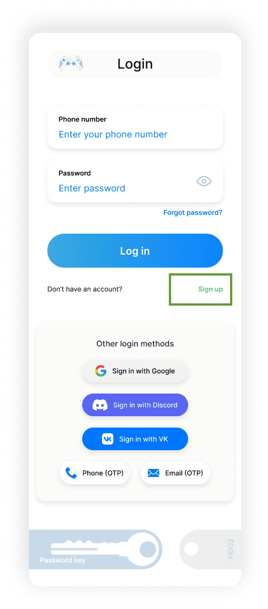
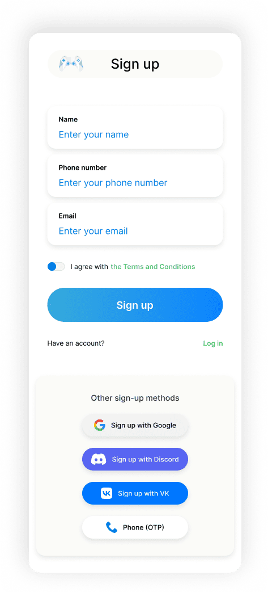
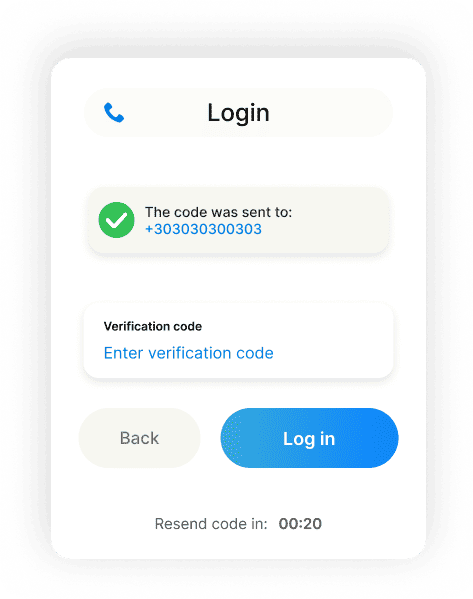
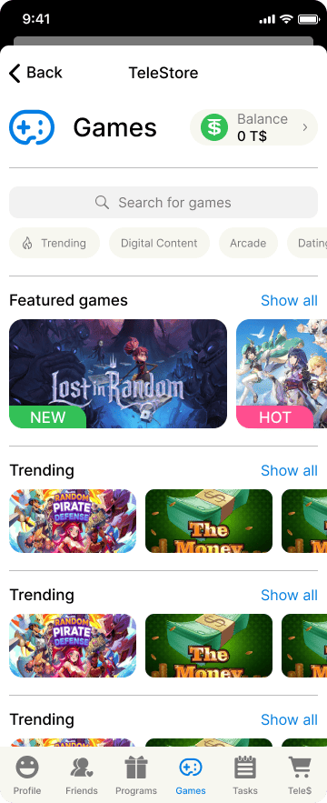

# 👤 Создание аккаунта разработчика

## Регистрация

[//]: # (
❗Временно регистрация работает только через Телеграм-бота
)

### Регистрация через сайт TeleStore

1. Откройте страницу авторизации https://web.tele.store
2. Внизу формы авторизации нажмите кнопку 
Зарегистрироваться

   
💡 В скором времени будет добавлена авторизация через Google, Twitter, Facebook и Apple

3. Заполните форму регистрации, согласитесь с *Условиями и положениями* и нажмите 
Подтвердить

4. Введите 6-значный код из смс
   
❗Поддерживаются не все мобильные операторы, а также временно не работает отправка смс на номера США и Канады. Если на этапе получения смс-кода возникла ошибка, или смс-код не пришел, пожалуйста, [подтвердите телефон через Телеграм-бота](#telebotPhone)

5. Введите 6-значный код из почты
6. Если все прошло успешно, после регистрации вы будете перенаправлены на стартовый экран каталога TeleStore.

| 2. Форма авторизации                         | 3. Форма регистрации                              | 4. и 5. Ввод 6-значного кода                      | 6. Стартовый экран TeleStore                                       |
|----------------------------------------------|---------------------------------------------------|---------------------------------------------------|--------------------------------------------------------------------|
|  |  |  |  |

### Регистрация через Телеграм-бота

1. В Телеграме откройте бота [@TeleStoreChatBot](https://t.me/TeleStoreChatBot) и нажмите кнопку Start
2. Бот предложит поделиться вашим Контактом для подтверждения номера телефона. В меню снизу нажмите на 
📞 Link my phone
, чтобы поделиться своим контактом с ботом
3. Также необходимо подтвердить электронную почту. Нажмите в меню снизу на кнопку 
📧 Link my email
, после чего отправьте боту ваш существующий электронный адрес
4. На почту будет отправлен код вида `ecode-...`, скопируйте его весь (вместе с `ecode-`) и отправьте боту

[//]: # (
)

[//]: # (
)

После прохождения регистрации вы можете зайти в свой аккаунт TeleStore как с помощью Телеграм-бота, так и через сайт https://web.tele.store. Для входа через сайт используйте свой подтвержденный email, на него будет выслан единоразовый 6-значный код для авторизации.

## Получение статуса Разработчика

❗Для получения статуса Разработчика необходимо сначала подтвердить и email, и телефон

1. Откройте TeleStore через Телеграм-бота или сайт
2. Перейдите на вкладку 
Профиль

3. Прокрутите страницу вниз и нажмите на кнопку 
Стать Разработчиком

4. Заполните форму и нажмите 
Изменить тип аккаунта

После этого ваш тип аккаунта сменится, вам будет доступен кабинет Разработчика и возможность размещать приложения.

## Регистрация аккаунта Разработчика в Песочнице

Проделайте аналогичные шаги, используя Телеграм-бота [@Telestoregamebot](https://t.me/Telestoregamebot) и сайт https://dev.tele.store:8081.